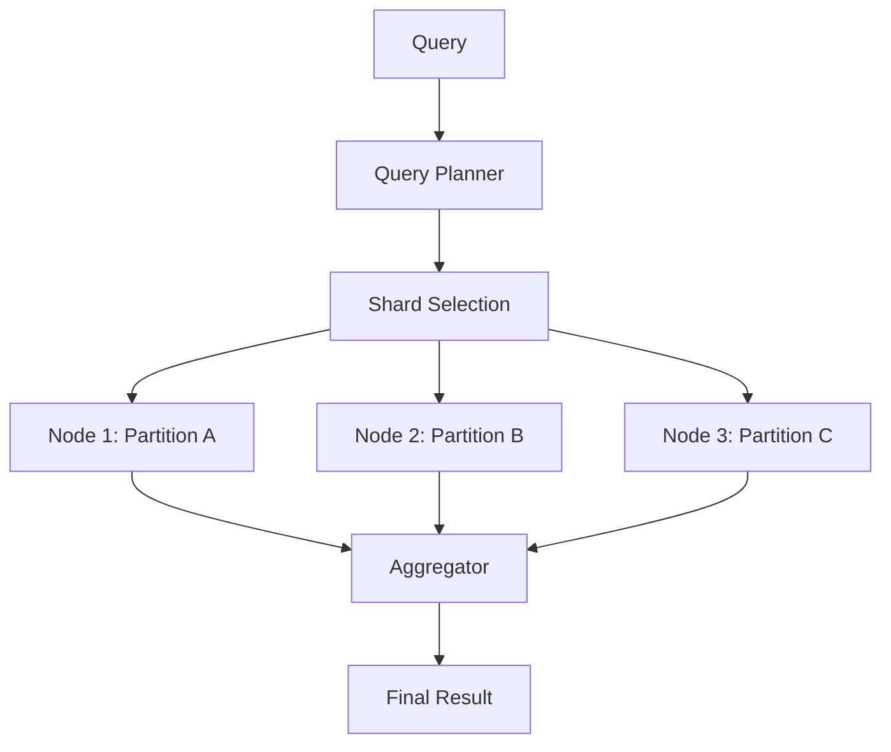

# Distributed Queries

How queries are distributed and executed across nodes.

---

## Query Execution Flow



---

## Query Types

| Type | Distribution | Example |
|------|--------------|---------|
| **Point** | Single node | `get_account(pubkey)` |
| **Range** | Multiple nodes | `get_transactions(start, end)` |
| **Scatter-Gather** | All nodes | `search(pattern)` |

---

## Query Planning

```rust
pub struct QueryPlan {
    pub sub_queries: Vec<SubQuery>,
    pub aggregation: AggregationType,
    pub estimated_cost: u64,
}

impl QueryPlanner {
    pub fn plan(&self, query: &Query) -> QueryPlan {
        match query.query_type {
            QueryType::PointLookup { key } => {
                let node = self.ring.get_node(&key);
                QueryPlan::single(node, query)
            }
            QueryType::RangeScan { start, end } => {
                let nodes = self.ring.get_range_nodes(start, end);
                QueryPlan::parallel(nodes, query)
            }
            QueryType::FullScan => {
                QueryPlan::scatter_gather(self.all_nodes(), query)
            }
        }
    }
}
```

---

## Parallel Execution

```rust
pub async fn execute_parallel(&self, plan: QueryPlan) -> Result<QueryResult> {
    let futures: Vec<_> = plan.sub_queries
        .iter()
        .map(|sq| self.execute_sub_query(sq))
        .collect();

    let results = futures::future::join_all(futures).await;

    self.aggregate(results, plan.aggregation)
}
```

---

## Result Aggregation

| Operation | Method |
|-----------|--------|
| `COUNT` | Sum partial counts |
| `SUM` | Sum partial sums |
| `AVG` | Weighted average |
| `MIN/MAX` | Compare partials |
| `LIMIT` | Merge and truncate |

---

## Performance Tips

1. **Use point queries** when possible
2. **Add filters** to reduce data transfer
3. **Limit result size** with pagination
4. **Cache frequent queries** client-side
