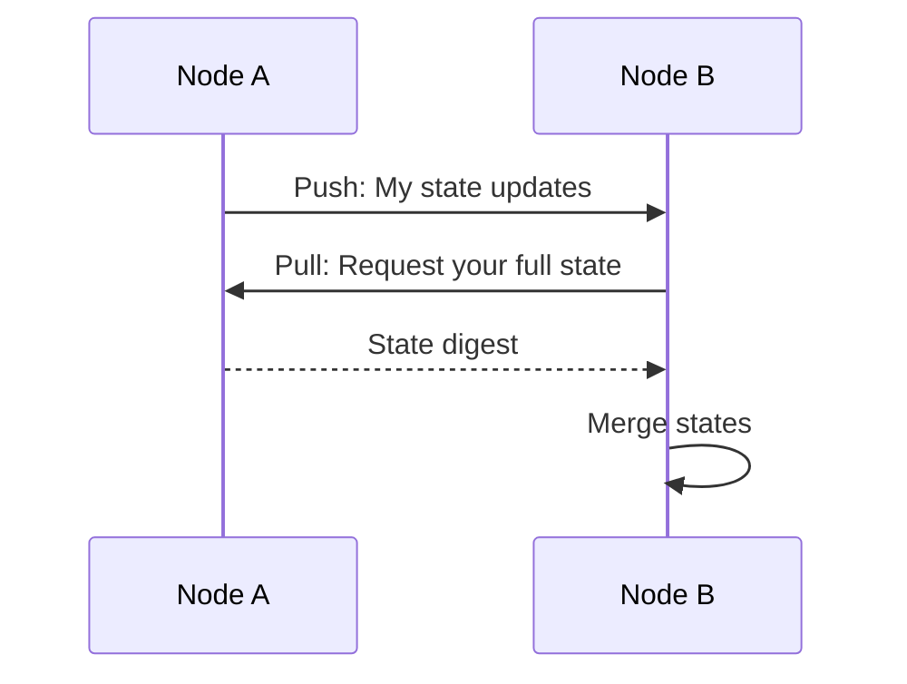
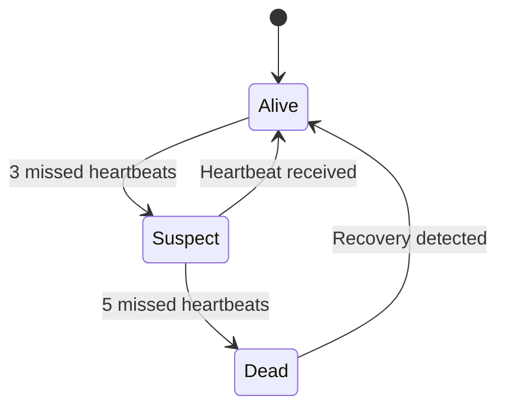

# Gossip Protocol

How nodes maintain consistent network state.

---

## Overview

StreamSync uses a gossip protocol for:

- Node discovery
- Health monitoring
- State synchronization
- Failure detection

---

## Protocol Modes

### Push-Pull (Default)

Combines push and pull for best consistency:



### Configuration

```toml
[gossip]
protocol = "push-pull"
fanout = 3
pull_interval_seconds = 5
heartbeat_interval_seconds = 1
failure_threshold_missed_heartbeats = 5
```

---

## Message Types

| Message | Purpose |
|---------|---------|
| `Heartbeat` | Liveness check |
| `Push` | Send state updates |
| `Pull` | Request state |
| `Sync` | Full state sync |
| `Suspect` | Report suspected failure |

---

## Failure Detection



Suspected nodes are:
- Excluded from query routing
- Gossiped to other nodes
- Monitored for recovery

---

## Network Ports

| Port | Protocol | Purpose |
|------|----------|---------|
| 7878 | UDP/TCP | Gossip messages |
| 7879 | TCP | State sync |

---

## Tuning

| Parameter | Low Latency | High Consistency |
|-----------|-------------|------------------|
| `fanout` | 2 | 5 |
| `heartbeat_interval` | 500ms | 2s |
| `pull_interval` | 10s | 2s |
