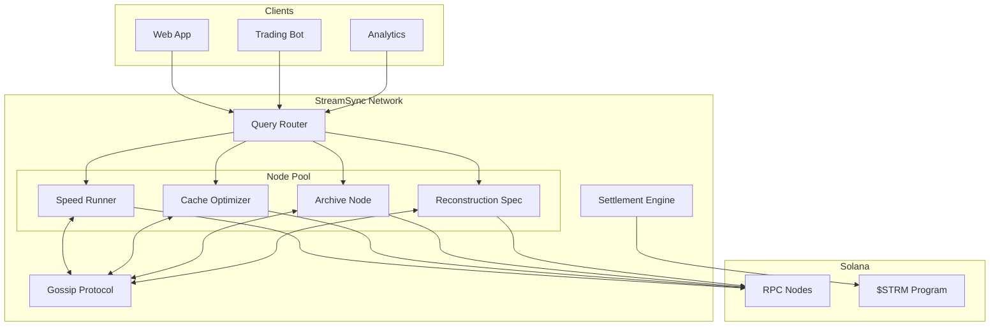
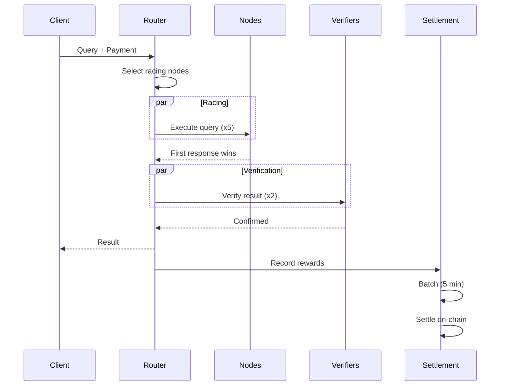
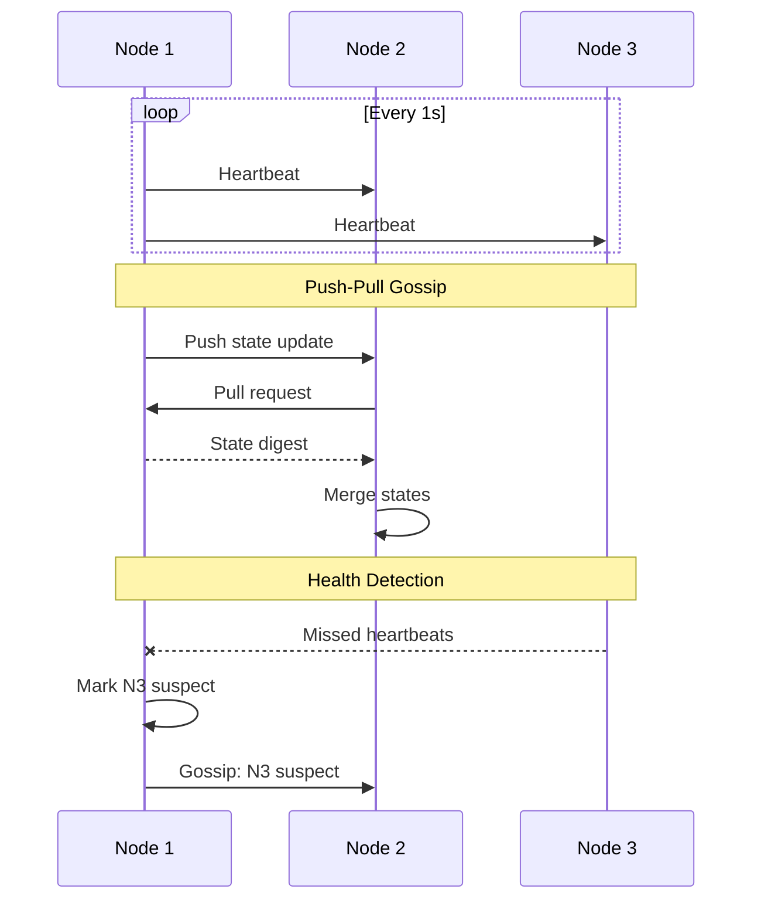
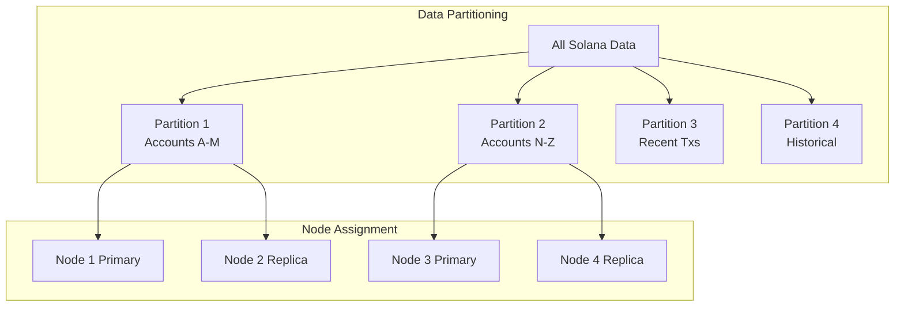
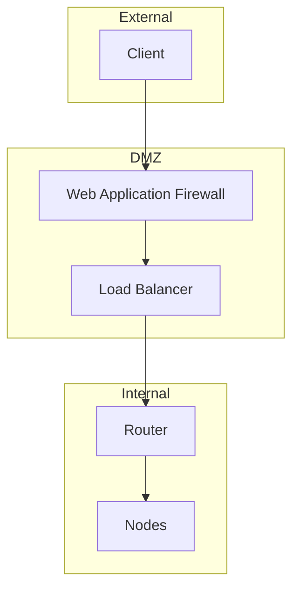
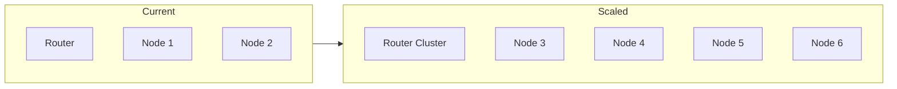
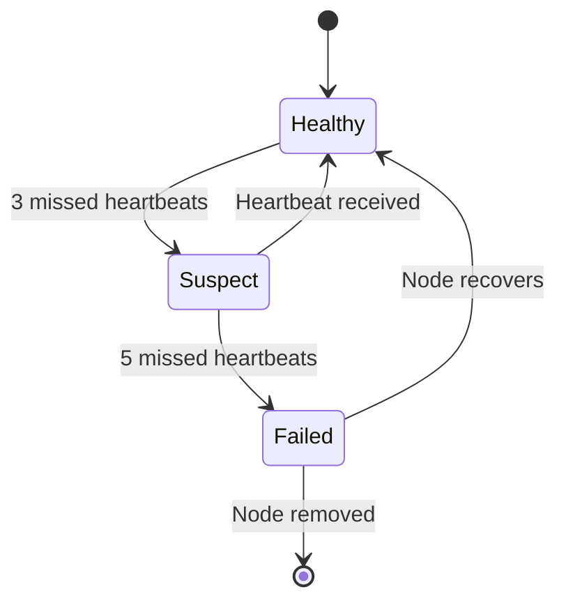

# Architecture Overview

System design and component interaction.

---

## High-Level Architecture



---

## Core Components

### 1. Query Router

Routes incoming queries to appropriate nodes:

```rust
pub struct QueryRouter {
    node_registry: NodeRegistry,
    load_balancer: LoadBalancer,
    racing_manager: RacingManager,
}

impl QueryRouter {
    pub async fn route_query(&self, query: Query) -> Result<QueryResult> {
        // 1. Find capable nodes
        let candidates = self.node_registry
            .find_capable(&query.query_type);

        // 2. Select racing participants
        let racers = self.load_balancer
            .select_weighted(candidates, 5);

        // 3. Execute race
        self.racing_manager
            .execute_race(racers, query)
            .await
    }
}
```

### 2. Node Registry

Tracks all active nodes and their capabilities:

```rust
pub struct NodeRegistry {
    nodes: DashMap<NodeId, NodeInfo>,
    capabilities: HashMap<QueryType, Vec<NodeId>>,
    health_checker: HealthChecker,
}

pub struct NodeInfo {
    id: NodeId,
    specialization: NodeSpecialization,
    endpoint: SocketAddr,
    stake: u64,
    reputation: ReputationScore,
    last_heartbeat: Instant,
}
```

### 3. Racing Manager

Orchestrates query racing:

```rust
pub struct RacingManager {
    verifier_pool: VerifierPool,
    reward_recorder: RewardRecorder,
}

impl RacingManager {
    pub async fn execute_race(&self, nodes: Vec<NodeId>, query: Query)
        -> Result<RaceResult>
    {
        // Parallel dispatch
        let responses = self.dispatch_parallel(nodes, &query).await;

        // Find winner (first valid)
        let winner = self.find_winner(responses)?;

        // Verify result
        let verifiers = self.verifier_pool.verify(&winner.result).await?;

        // Record rewards
        self.reward_recorder.record(
            winner.node,
            verifiers,
            query.payment
        ).await?;

        Ok(winner)
    }
}
```

### 4. Gossip Protocol

Maintains network state across nodes:

```rust
pub struct GossipProtocol {
    local_state: Arc<RwLock<NetworkState>>,
    peers: Vec<PeerConnection>,
    mode: GossipMode, // Push, Pull, or PushPull
}

impl GossipProtocol {
    // Push updates to peers
    pub async fn push(&self, update: StateUpdate) {
        for peer in self.random_peers(3) {
            peer.send(GossipMessage::Push(update.clone())).await;
        }
    }

    // Pull state from peers
    pub async fn pull(&self) {
        for peer in self.random_peers(3) {
            let remote = peer.request_state().await;
            self.merge_state(remote);
        }
    }
}
```

### 5. Settlement Engine

Batches and settles rewards:

```rust
pub struct SettlementEngine {
    pending: DashMap<NodeId, Vec<Reward>>,
    batch_interval: Duration,
    anchor_client: AnchorClient,
}

impl SettlementEngine {
    pub async fn run(&self) {
        loop {
            tokio::time::sleep(self.batch_interval).await;
            self.process_batch().await;
        }
    }

    async fn process_batch(&self) {
        let batch = self.collect_pending();

        // Single Solana transaction for all rewards
        self.anchor_client
            .process_settlement_batch(batch)
            .await
            .expect("Settlement failed");
    }
}
```

---

## Data Flow

### Query Execution



### State Synchronization



---

## Storage Architecture

### Per-Node Storage

```
data/
├── duckdb/
│   ├── accounts.duckdb     # Account state
│   ├── transactions.duckdb # Transaction history
│   └── tokens.duckdb       # Token data
├── cache/
│   ├── hot/                # In-memory LRU
│   └── warm/               # SSD-backed
└── logs/
    └── streamsync.log
```

### Distributed Data



---

## Security Architecture

### Network Security



### Authentication

| Layer | Method |
|-------|--------|
| Client → Router | API Key + HMAC |
| Router → Node | mTLS |
| Node → Node | Signed messages |
| Node → Solana | Wallet signature |

---

## Scalability

### Horizontal Scaling



### Capacity Planning

| Nodes | Queries/Second | Latency (p99) |
|-------|---------------|---------------|
| 10 | 10,000 | 15ms |
| 50 | 50,000 | 12ms |
| 100 | 100,000 | 10ms |
| 500 | 500,000 | 8ms |

---

## Failure Handling

### Node Failure



### Data Recovery

1. **Hot standby** - Replica takes over immediately
2. **Rebalancing** - Data redistributed to healthy nodes
3. **Reconstruction** - Rebuild from Solana RPC if needed

---

## Next Steps

- [Core Libraries](core-libraries.md) - Implementation details
- [Gossip Protocol](gossip-protocol.md) - Network coordination
- [Distributed Queries](distributed-queries.md) - Query execution
