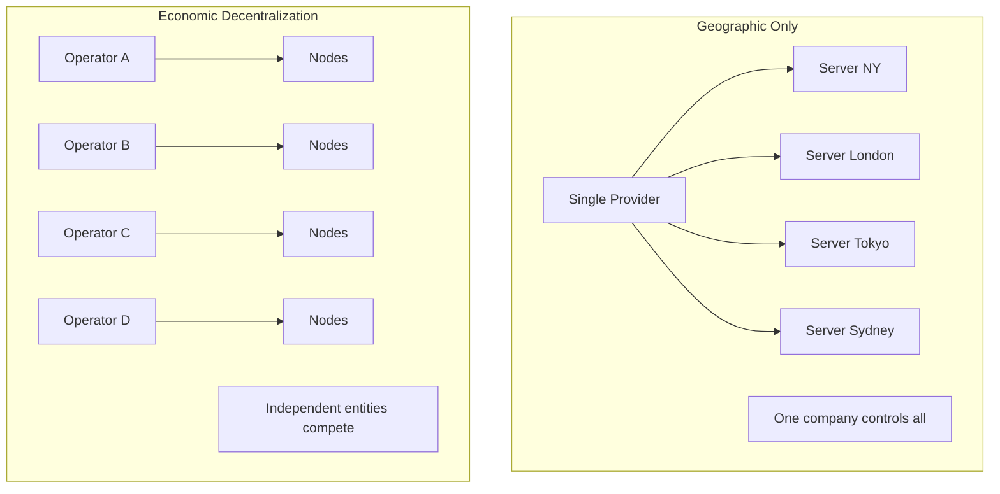
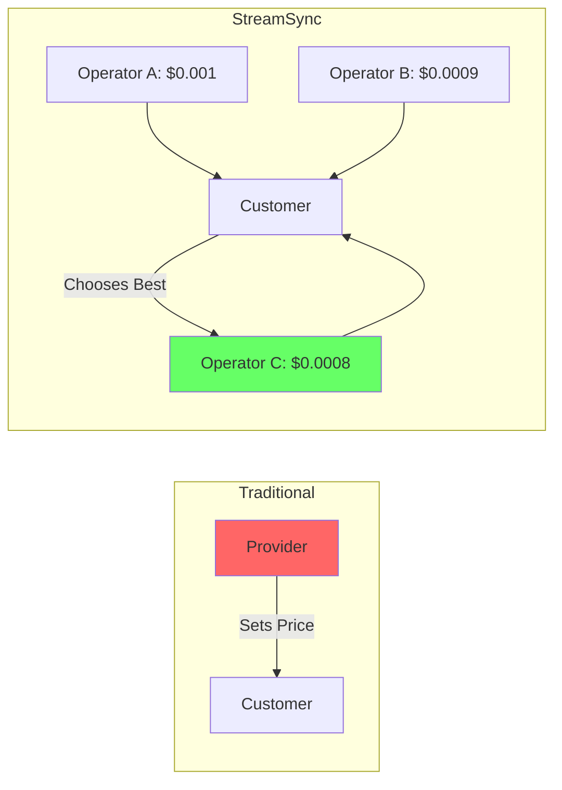
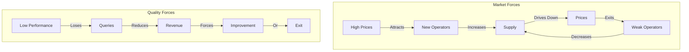

# Economic Decentralization

Why economic competition matters more than geographic distribution.

---

## Core Principle

> True decentralization isn't about where servers are located - it's about **who controls pricing, availability, and access decisions**.

---

## The Problem with Geographic Decentralization Alone

Having servers in multiple locations doesn't solve these problems:

| Problem | Example |
|---------|---------|
| **Price Control** | Single company sets prices regardless of server count |
| **Access Restrictions** | Provider can ban any customer at will |
| **Feature Lock-in** | Users depend on one provider's roadmap |
| **Negotiating Power** | No competition = no leverage |
| **Innovation Stagnation** | No incentive to improve |

A company with 100 servers in 50 countries is still a single point of control.

---

## Economic Decentralization Defined

Economic decentralization means:

1. **Multiple independent operators** making independent decisions
2. **Market-driven pricing** based on supply and demand
3. **Competition for customers** through performance and price
4. **Protocol-level access rights** that can't be revoked
5. **No single entity** can control the network



---

## Benefits for Customers

### 1. Fair Pricing



- Supply and demand determine prices
- Operators compete on price and performance
- No vendor lock-in

### 2. Guaranteed Access

Traditional providers can:

- ❌ Change terms of service
- ❌ Suspend accounts arbitrarily
- ❌ Require compliance with new policies

StreamSync provides:

- ✅ Protocol-level access rights
- ✅ No central authority to ban you
- ✅ Pay and access - that's the contract

### 3. Performance Guarantees

| Scenario | Traditional | StreamSync |
|----------|-------------|------------|
| SLA missed | Maybe get credit | Automatic refund |
| Performance degrades | No recourse | Switch operators instantly |
| Outage | Wait for fix | Other operators serve |

---

## Benefits for Operators

### 1. Direct Revenue

- Earn based on performance, not politics
- No platform fees beyond protocol costs
- Keep 50% of query fees you serve

### 2. Competitive Advantage

```rust
// Better performance = more queries = more revenue
if my_latency < competitor_latency {
    probability_of_winning_race += bonus;
    reputation_score += improvement;
    future_selection_probability += boost;
}
```

### 3. Specialization Opportunities

Different operators can specialize:

| Specialization | Market |
|----------------|--------|
| Speed Runners | Low-latency trading |
| Archive Nodes | Historical analysis |
| Cache Optimizers | High-volume apps |
| ZK Reconstruction | Compressed accounts |

---

## How Competition Works

### Node Selection

```rust
pub fn select_racing_nodes(&self, query: Query) -> Vec<NodeId> {
    let capable_nodes = self.find_capable_nodes(&query);

    // Weight by reputation and performance
    let weights: Vec<_> = capable_nodes.iter()
        .map(|n| calculate_weight(n))
        .collect();

    // Probabilistic selection favors better nodes
    self.weighted_random_selection(capable_nodes, weights, 5)
}

fn calculate_weight(node: &Node) -> f64 {
    (node.performance_score * 0.4)
        + (node.accuracy_score * 0.3)
        + (node.uptime_score * 0.2)
        + (node.stake_score.ln() * 0.1)
}
```

Better operators get:

- Higher selection probability
- More queries
- More revenue
- Higher reputation

### Market Equilibrium



---

## Day 1 Decentralization

Unlike networks that "plan to decentralize later," StreamSync launches with:

### Phase 1: Launch (Months 1-6)

- 4-5 independent operators
- 2-3 nodes each
- Full economic competition
- Market-driven pricing

### Phase 2: Growth (Months 6-18)

- Open operator onboarding
- Staking-based admission
- Geographic expansion
- Advanced specializations

### Phase 3: Maturity (Month 18+)

- Permissionless participation
- Automated admission
- Full infrastructure diversity
- Self-sustaining economics

---

## Comparison

| Aspect | Centralized | "Decentralized" | StreamSync |
|--------|-------------|-----------------|------------|
| **Day 1 Operators** | 1 | 1 (promises more) | 4-5+ |
| **Price Control** | Single entity | Single entity | Market |
| **Access Control** | Provider | Provider | Protocol |
| **Competition** | None | None | Continuous |
| **SLA Enforcement** | Trust | Trust | Economic |
| **Switching Cost** | High | High | Zero |

---

## Summary

Economic decentralization provides:

- **Customer Power**: Market pricing, guaranteed access, performance enforcement
- **Operator Opportunity**: Direct revenue, competitive differentiation, specialization
- **Network Resilience**: No single point of failure, control, or censorship

!!! quote "Key Insight"
    A network run by 100 independent operators in one data center is more decentralized than a network run by one company across 100 data centers.
