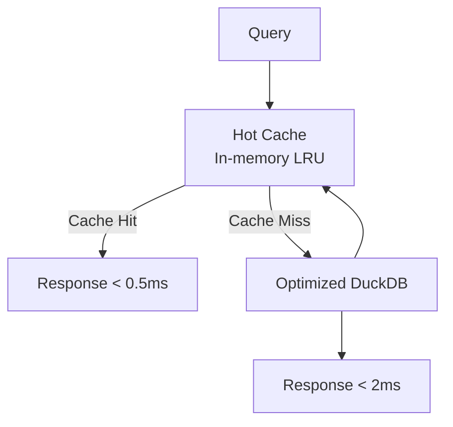
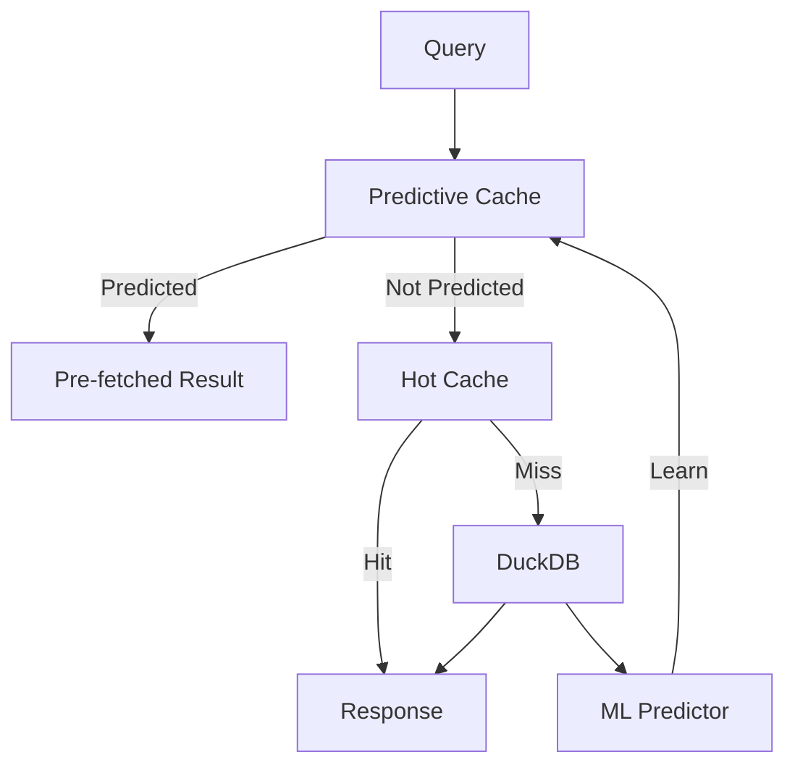
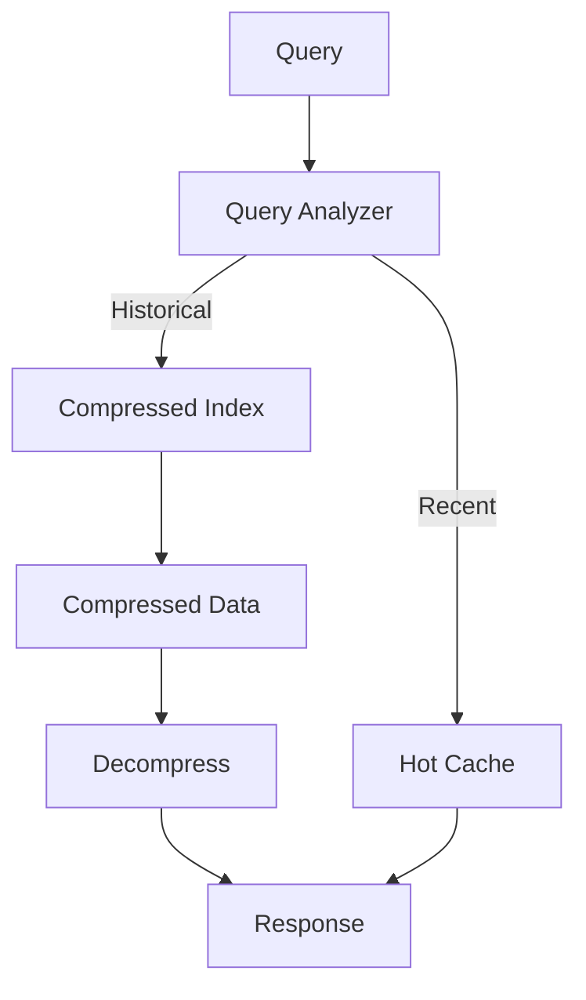
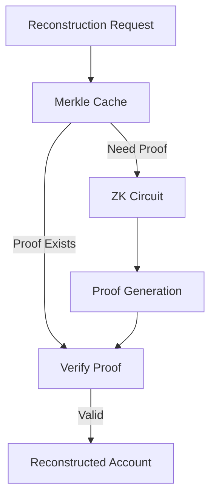
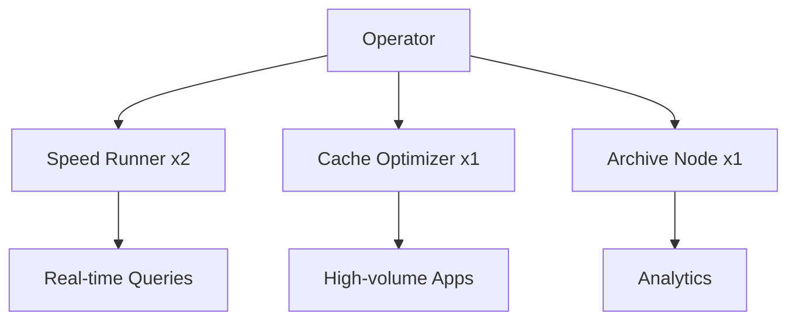

# Node Specializations

Different node types optimized for different workloads.

---

## Overview

StreamSync supports four node specializations, each optimized for specific query types:

| Type | Focus | Best For |
|------|-------|----------|
| **Speed Runner** | Lowest latency | Trading, real-time apps |
| **Cache Optimizer** | High hit rates | High-volume applications |
| **Archive Node** | Historical data | Analytics, research |
| **Reconstruction Spec** | ZK proofs | Compressed accounts |

---

## Speed Runner

Optimized for sub-millisecond query latency.

### Characteristics

| Property | Value |
|----------|-------|
| **Target Latency** | < 1ms |
| **RAM Required** | 64GB+ |
| **Query Types** | Simple lookups, token balances |
| **Reward Bonus** | +30% |

### Architecture



### Configuration

```toml
[node]
type = "speed-runner"

[specialization]
target_latency_ms = 1
cache_capacity_gb = 32
supported_query_types = [
    "simple_account_lookup",
    "token_balance",
    "basic_aggregation"
]

[database]
memory_limit = "90%"
cache_size_mb = 8192

[performance]
query_timeout_ms = 5
cache_ttl_seconds = 2
```

### Best Practices

1. **Maximize RAM** - More cache = more hits
2. **NVMe storage** - Fast fallback for misses
3. **Low-latency network** - Every microsecond counts
4. **Limit query types** - Specialize in fast queries only

---

## Cache Optimizer

Optimized for high cache hit rates with predictive caching.

### Characteristics

| Property | Value |
|----------|-------|
| **Target Hit Rate** | > 95% |
| **RAM Required** | 128GB+ |
| **Query Types** | All except reconstruction |
| **Reward Bonus** | +50% |

### Architecture



### Configuration

```toml
[node]
type = "cache-optimizer"

[specialization]
hot_data_threshold_queries = 50
eviction_policy = "adaptive"  # lru, lfu, adaptive
predictive_caching = true
prediction_model = "frequency-recency"

[database]
memory_limit = "85%"
cache_size_mb = 32768

[performance]
cache_ttl_seconds = 60
prediction_window_minutes = 15
```

### Predictive Caching

The cache optimizer uses ML to predict which data will be needed:

```rust
pub struct PredictiveCache {
    frequency_map: HashMap<QueryPattern, u64>,
    recency_queue: VecDeque<QueryPattern>,
    time_patterns: HashMap<TimeSlot, Vec<QueryPattern>>,
}

impl PredictiveCache {
    pub fn predict_next_queries(&self) -> Vec<QueryPattern> {
        // Combine frequency, recency, and time patterns
        let freq_predictions = self.high_frequency_patterns();
        let time_predictions = self.time_based_patterns(current_time_slot());

        merge_predictions(freq_predictions, time_predictions)
    }

    pub async fn prefetch(&self, predictions: Vec<QueryPattern>) {
        for pattern in predictions {
            if !self.is_cached(&pattern) {
                let result = self.execute_query(&pattern).await;
                self.cache.insert(pattern, result);
            }
        }
    }
}
```

---

## Archive Node

Optimized for historical data access and large queries.

### Characteristics

| Property | Value |
|----------|-------|
| **Retention** | 1-2+ years |
| **Storage Required** | 4TB+ |
| **Query Types** | Historical, analytics |
| **Reward Bonus** | +20% |

### Architecture



### Configuration

```toml
[node]
type = "archive-node"

[specialization]
retention_days = 730  # 2 years
compression_level = 9  # Maximum compression
index_everything = true
partition_by = "month"

[database]
path = "./data/archive.duckdb"
memory_limit = "60%"

[performance]
query_timeout_ms = 60000  # 60 seconds for large scans
max_scan_rows = 100000000  # 100M rows
```

### Storage Optimization

```rust
pub struct ArchiveStorage {
    hot_partition: Partition,      // Last 7 days, uncompressed
    warm_partitions: Vec<Partition>, // 7-90 days, light compression
    cold_partitions: Vec<Partition>, // 90+ days, heavy compression
}

impl ArchiveStorage {
    pub fn query(&self, time_range: TimeRange) -> QueryPlan {
        let partitions = self.select_partitions(time_range);

        QueryPlan {
            // Query hot data first (fastest)
            hot_scan: partitions.hot,
            // Then warm data
            warm_scan: partitions.warm,
            // Finally cold data (decompress on demand)
            cold_scan: partitions.cold,
        }
    }
}
```

---

## Reconstruction Specialist

Optimized for ZK proof generation and compressed account reconstruction.

### Characteristics

| Property | Value |
|----------|-------|
| **Compute Required** | 32+ cores |
| **RAM Required** | 256GB+ |
| **Query Types** | ZK reconstruction only |
| **Reward Bonus** | +100% |

### Architecture



### Configuration

```toml
[node]
type = "reconstruction-spec"

[specialization]
merkle_cache_size_mb = 8192
zk_proof_workers = 16
proof_cache_ttl_hours = 24
supported_compression_types = [
    "spl-account-compression",
    "bubblegum",
]

[database]
memory_limit = "70%"
threads = 16

[performance]
query_timeout_ms = 30000
max_concurrent_proofs = 8
```

### ZK Reconstruction Process

```rust
pub struct ReconstructionSpecialist {
    merkle_cache: LruCache<MerkleRoot, MerkleTree>,
    proof_cache: LruCache<LeafId, ZKProof>,
    zk_workers: ThreadPool,
}

impl ReconstructionSpecialist {
    pub async fn reconstruct(&self, request: ReconstructionRequest)
        -> Result<ReconstructedAccount>
    {
        // Check proof cache
        if let Some(proof) = self.proof_cache.get(&request.leaf_id) {
            return self.verify_and_reconstruct(proof, &request);
        }

        // Get or build merkle tree
        let tree = self.get_merkle_tree(&request.merkle_root).await?;

        // Generate ZK proof (expensive)
        let proof = self.zk_workers.spawn(async move {
            generate_zk_proof(&tree, &request.leaf_id)
        }).await?;

        // Cache for future
        self.proof_cache.insert(request.leaf_id, proof.clone());

        self.verify_and_reconstruct(&proof, &request)
    }
}
```

---

## Choosing a Specialization

### Decision Matrix

| If you have... | Consider... |
|----------------|-------------|
| High-end RAM (128GB+) | Cache Optimizer |
| Low-latency network | Speed Runner |
| Large storage (4TB+) | Archive Node |
| High-end CPU (32+ cores) | Reconstruction Spec |
| General hardware | Speed Runner (simplest) |

### Revenue Comparison

Estimated daily revenue at network maturity:

| Specialization | Queries/Day | Avg Reward | Daily Revenue |
|----------------|-------------|------------|---------------|
| Speed Runner | 100,000 | 0.0013 STRM | 130 STRM |
| Cache Optimizer | 80,000 | 0.0015 STRM | 120 STRM |
| Archive Node | 10,000 | 0.0012 STRM | 12 STRM |
| Reconstruction | 5,000 | 0.002 STRM | 10 STRM |

!!! note "Market Dynamics"
    Actual revenue depends on network demand for each query type. Niche specializations (Archive, Reconstruction) have less competition.

---

## Multi-Specialization

Advanced operators can run multiple node types:



### Benefits

- Serve wider range of queries
- Diversified revenue streams
- Better resource utilization
- Higher total rewards
