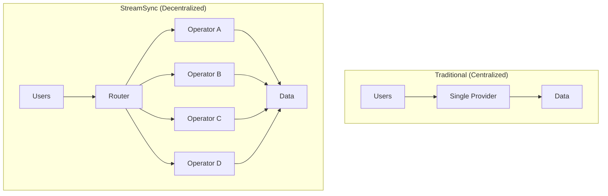
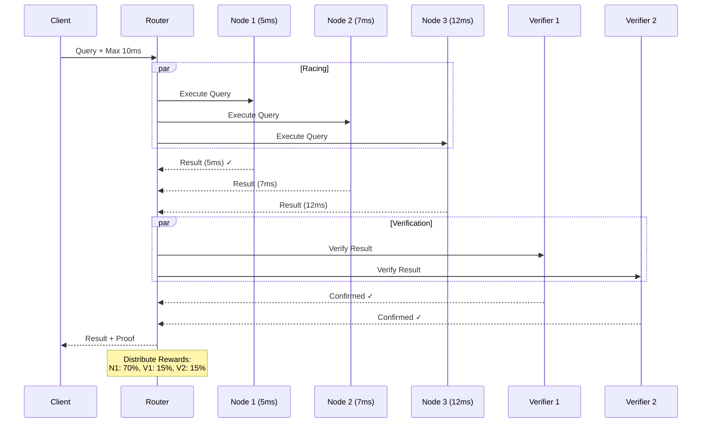
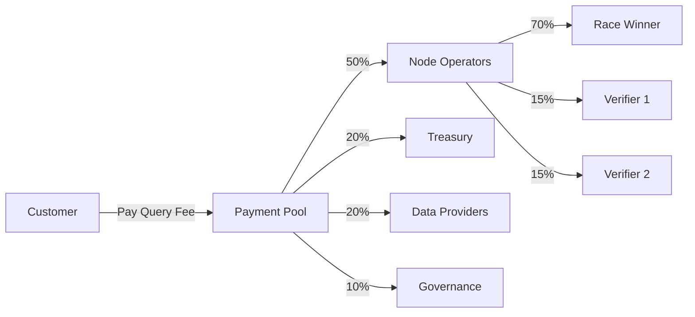

# Concepts Overview

Understanding the core concepts behind StreamSync.

---

## What is StreamSync?

StreamSync is a **decentralized indexing network** for Solana that delivers:

- **Sub-10ms query performance** with economic guarantees
- **Market-driven pricing** eliminating vendor lock-in
- **Multiple independent operators** competing from day one
- **Specialized nodes** optimized for different workloads

---

## The Problem

Traditional Solana indexing solutions suffer from:

| Problem | Impact |
|---------|--------|
| **Vendor Lock-in** | Single provider controls pricing and access |
| **Arbitrary Pricing** | No market competition drives up costs |
| **Single Points of Failure** | Provider outages affect all users |
| **No Performance Guarantees** | Pay regardless of service quality |
| **Centralized Control** | Provider can restrict access anytime |

---

## The Solution

StreamSync introduces **economic decentralization**:

**Key differences:**

| Aspect | Centralized | StreamSync |
|--------|-------------|------------|
| **Operators** | Single company | Multiple independent |
| **Pricing** | Set by provider | Market-driven |
| **Performance** | Best effort | Guaranteed (or free) |
| **Access** | Can be restricted | Protocol-level rights |
| **Competition** | None | Continuous |

---

## Core Concepts

### 1. Economic Decentralization

True decentralization isn't about server locations - it's about **who controls pricing, availability, and access decisions**.

[:octicons-arrow-right-24: Learn more](economic-decentralization.md)

### 2. Racing Competition

3-5 nodes race to answer each query. The fastest correct response wins 70% of the payment.

[:octicons-arrow-right-24: Learn more](racing-competition.md)

### 3. Node Specializations

Different nodes optimize for different workloads: speed, caching, archival, or ZK reconstruction.

[:octicons-arrow-right-24: Learn more](node-specializations.md)

### 4. Performance Guarantees

Miss the SLA? The customer doesn't pay. Economics enforce quality.

[:octicons-arrow-right-24: Learn more](../tokenomics/pricing.md)

---

## How It Works

### Query Flow

### Economic Flow

---

## Network Participants

### Customers

- Query Solana data with performance guarantees
- Pay per query with STRM, SOL, or USDC
- Get refunds when SLA is missed

### Node Operators

- Run specialized nodes serving queries
- Earn STRM by winning races
- Stake STRM as collateral (min 10,000)

### Token Holders

- Stake STRM to earn governance rewards (10% of fees)
- Vote on protocol parameters
- Delegate to operators

### Data Providers

- Provide Solana RPC access
- Earn 20% of query fees
- Enable network data access

---

## Technology Stack

| Component | Technology |
|-----------|------------|
| **Language** | Rust |
| **Database** | DuckDB (distributed) |
| **Networking** | NNG (nanomsg) |
| **Blockchain** | Solana |
| **Smart Contracts** | Anchor |
| **Consensus** | Gossip protocol (push-pull) |

---

## Next Steps

-   :material-scale-balance:{ .lg .middle } __Economic Decentralization__

    ---

    Why economics matter more than geography

    [:octicons-arrow-right-24: Read](economic-decentralization.md)

-   :material-lightning-bolt:{ .lg .middle } __Racing Competition__

    ---

    How nodes compete for rewards

    [:octicons-arrow-right-24: Read](racing-competition.md)

-   :material-server-network:{ .lg .middle } __Node Specializations__

    ---

    Different nodes for different needs

    [:octicons-arrow-right-24: Read](node-specializations.md)

