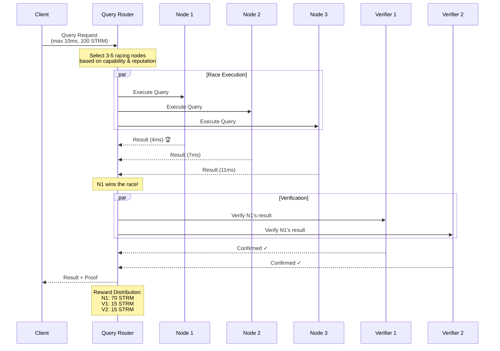
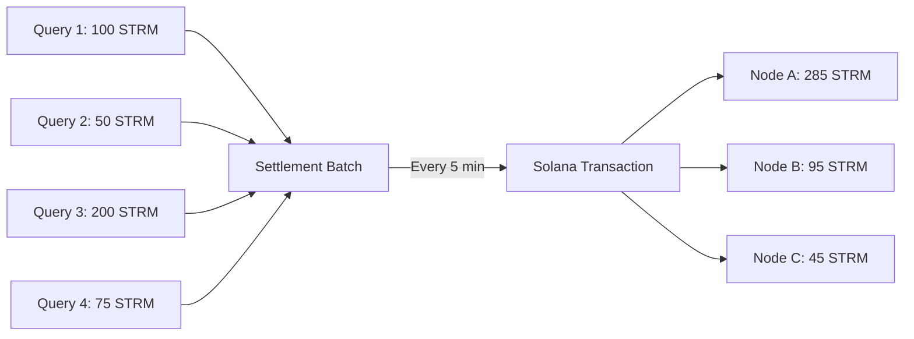

# Racing Competition

How nodes compete to serve queries and earn rewards.

---

## Overview

Every query triggers a **racing competition** between 3-5 nodes:

1. Query is broadcast to selected nodes
2. Nodes race to provide the fastest correct response
3. First correct answer wins 70% of payment
4. Two verifiers confirm correctness, earn 15% each

---

## How Racing Works



---

## Node Selection

Nodes are selected for racing based on:

### Capability Matching

```rust
pub fn find_capable_nodes(&self, query: &Query) -> Vec<&Node> {
    self.nodes.iter()
        .filter(|node| {
            // Must support query type
            node.supports_query_type(&query.query_type)
            // Must have capacity
            && node.current_load < node.max_capacity
            // Must be active
            && node.is_active()
            // Must have required specialization (if any)
            && query.required_spec.map_or(true, |s| node.specialization == s)
        })
        .collect()
}
```

### Weighted Selection

Better nodes are more likely to be selected:

| Factor | Weight | Description |
|--------|--------|-------------|
| **Performance** | 40% | Recent latency scores |
| **Accuracy** | 30% | Correct response rate |
| **Uptime** | 20% | Availability history |
| **Stake** | 10% | Economic commitment (log scale) |

```rust
fn calculate_selection_weight(node: &Node) -> f64 {
    let perf = node.avg_latency_score();      // 0.0 - 1.0
    let acc = node.accuracy_rate();            // 0.0 - 1.0
    let up = node.uptime_percentage();         // 0.0 - 1.0
    let stake = (node.stake as f64).ln() / 20.0; // Log scale

    (perf * 0.4) + (acc * 0.3) + (up * 0.2) + (stake * 0.1)
}
```

---

## Race Execution

### Parallel Query Dispatch

```rust
pub async fn execute_race(&self, query: Query) -> Result<RaceResult> {
    let candidates = self.select_racing_candidates(3..=5)?;
    let (tx, mut rx) = mpsc::channel(candidates.len());

    // Dispatch to all candidates in parallel
    for node in &candidates {
        let tx = tx.clone();
        let query = query.clone();
        let node_id = node.id;

        tokio::spawn(async move {
            let start = Instant::now();
            let result = node.execute_query(&query).await;
            let latency = start.elapsed();

            let _ = tx.send(RaceEntry {
                node_id,
                result,
                latency,
            }).await;
        });
    }

    // Await first valid response
    self.await_winner(&mut rx, query.max_latency).await
}
```

### Winner Determination

```rust
async fn await_winner(&self, rx: &mut Receiver<RaceEntry>, max_latency: Duration)
    -> Result<RaceResult>
{
    let deadline = Instant::now() + max_latency;

    while Instant::now() < deadline {
        match rx.try_recv() {
            Ok(entry) => {
                // Validate result quickly
                if self.quick_validate(&entry.result) {
                    return Ok(RaceResult {
                        winner: entry.node_id,
                        result: entry.result,
                        latency: entry.latency,
                    });
                }
            }
            Err(_) => tokio::time::sleep(Duration::from_micros(100)).await,
        }
    }

    Err(RaceError::Timeout)
}
```

---

## Verification

After a winner is determined, the result is verified:

### Verifier Selection

- 2 verifiers selected from non-racing nodes
- Weighted by accuracy history
- Cannot be same operator as winner

### Verification Process

```rust
pub async fn verify_result(&self, result: &QueryResult, winner: NodeId)
    -> Result<VerificationResult>
{
    let verifiers = self.select_verifiers(2, winner)?;

    let verifications = futures::join_all(
        verifiers.iter().map(|v| v.verify(result))
    ).await;

    // Require 2/2 confirmations
    let confirmed = verifications.iter()
        .filter(|v| v.is_ok() && v.as_ref().unwrap().confirmed)
        .count();

    if confirmed >= 2 {
        Ok(VerificationResult::Confirmed(verifiers))
    } else {
        // Dispute resolution
        self.handle_verification_failure(result, verifications).await
    }
}
```

---

## Reward Distribution

### Standard Distribution

| Recipient | Share | Example (100 STRM query) |
|-----------|-------|--------------------------|
| **Winner** | 70% | 70 STRM |
| **Verifier 1** | 15% | 15 STRM |
| **Verifier 2** | 15% | 15 STRM |

### Performance Bonuses

Winners can earn additional bonuses:

| Performance | Bonus |
|-------------|-------|
| Sub-1ms response | +50% |
| Sub-5ms response | +20% |
| Perfect accuracy | +10% |

```rust
fn calculate_winner_reward(&self, base_reward: u64, latency: Duration) -> u64 {
    let mut reward = base_reward;

    // Speed bonuses
    if latency < Duration::from_millis(1) {
        reward = (reward as f64 * 1.5) as u64;
    } else if latency < Duration::from_millis(5) {
        reward = (reward as f64 * 1.2) as u64;
    }

    reward
}
```

---

## Batch Settlement

Rewards are batched for gas efficiency:



### Why Batch?

| Approach | Gas Cost | Latency |
|----------|----------|---------|
| Per-query settlement | ~0.00001 SOL each | Immediate |
| Batch settlement | ~0.000005 SOL each | 5 min max |

Batching reduces gas costs by ~50% while maintaining acceptable settlement latency.

---

## SLA Enforcement

### Automatic Refunds

```rust
pub async fn handle_query_result(&self, result: QueryResult, request: QueryRequest)
    -> SettlementAction
{
    match (result.latency <= request.max_latency, result.is_valid) {
        (true, true) => {
            // SLA met: distribute rewards
            SettlementAction::DistributeRewards {
                winner: result.winner,
                verifiers: result.verifiers,
                amount: request.payment,
            }
        }
        (false, _) | (_, false) => {
            // SLA missed: refund customer
            SettlementAction::RefundCustomer {
                customer: request.customer,
                amount: request.payment,
                reason: "SLA not met",
            }
        }
    }
}
```

### Customer Guarantee

- Miss latency target → Full refund
- Invalid result → Full refund
- No response → Full refund

---

## Anti-Gaming Measures

### Preventing Collusion

```rust
// Verifiers cannot be from same operator as winner
fn select_verifiers(&self, count: usize, winner: NodeId) -> Vec<NodeId> {
    let winner_operator = self.get_operator(winner);

    self.nodes.iter()
        .filter(|n| {
            n.id != winner
            && self.get_operator(n.id) != winner_operator
            && n.accuracy_rate() > 0.95
        })
        .take(count)
        .map(|n| n.id)
        .collect()
}
```

### Stake Slashing

Misbehavior results in stake slashing:

| Violation | Penalty |
|-----------|---------|
| Wrong result (proven) | 2% of stake |
| Verification collusion | 5% of stake |
| Repeated timeouts | 0.5% of stake |

---

## Summary

Racing competition ensures:

- ✅ **Fastest response wins** - incentivizes performance
- ✅ **Verification prevents cheating** - trustless correctness
- ✅ **Automatic SLA enforcement** - customers protected
- ✅ **Efficient settlement** - low gas costs
- ✅ **Anti-gaming measures** - honest behavior rewarded
