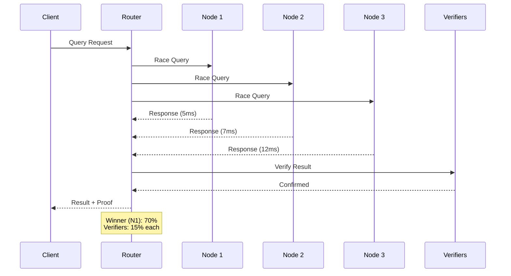

# StreamSync

**High-Performance Decentralized Indexing Network for Solana**

!!! warning "Under active development"

    StreamSync is under active development. APIs, schemas, and on-chain
    layouts may change. Production use at your own risk.
    Issues + PRs welcome — see the [GitHub repo](https://github.com/cryptuon/streamsync).

StreamSync delivers guaranteed sub-10ms Solana query performance through competitive node operations and market-driven incentives.

---

## Why StreamSync?

<div class="grid cards" markdown>

-   :material-speedometer:{ .lg .middle } __Sub-10ms Performance__

    ---

    Racing competition between 3-5 nodes ensures the fastest response wins. Performance guarantees backed by economics.

    [:octicons-arrow-right-24: Learn about racing](concepts/racing-competition.md)

-   :material-currency-usd:{ .lg .middle } __Fair Pricing__

    ---

    Market-driven pricing eliminates vendor lock-in. Pay only for performance delivered - miss the SLA, pay nothing.

    [:octicons-arrow-right-24: View pricing](tokenomics/pricing.md)

-   :material-shield-check:{ .lg .middle } __Economic Decentralization__

    ---

    Multiple independent operators compete from day one. No single entity controls access or pricing.

    [:octicons-arrow-right-24: Understand the model](concepts/economic-decentralization.md)

-   :material-rocket-launch:{ .lg .middle } __Node Specializations__

    ---

    Purpose-built nodes for different workloads: SpeedRunners, Archive Nodes, Cache Optimizers, ZK Reconstruction.

    [:octicons-arrow-right-24: Node types](concepts/node-specializations.md)

</div>

---

## Quick Start

Get started with StreamSync in minutes:

=== "Query the Network"

    ```bash
    # Install the CLI
    cargo install streamsync-cli

    # Query an account
    streamsync query account <PUBKEY>

    # Query with performance guarantee
    streamsync query account <PUBKEY> --max-latency 10ms
    ```

=== "Run a Node"

    ```bash
    # Clone and build
    git clone https://github.com/your-org/streamsync.git
    cd streamsync
    cargo build --release

    # Initialize node
    ./target/release/streamsync init --config node.toml

    # Start the node
    ./target/release/streamsync run
    ```

=== "Stake STRM"

    ```bash
    # Stake tokens to become a node operator
    streamsync stake 10000 --node-pubkey <YOUR_NODE>

    # Check staking status
    streamsync stake status
    ```

[:octicons-arrow-right-24: Full getting started guide](getting-started/quickstart.md)

---

## How It Works



1. **Client submits query** with performance requirements
2. **3-5 nodes race** to provide the fastest correct response
3. **First correct answer wins** 70% of the payment
4. **Verifiers confirm** correctness and earn 15% each
5. **Miss the SLA?** Client pays nothing

---

## Network Statistics

| Metric | Value |
|--------|-------|
| **Average Latency** | < 8ms |
| **Active Nodes** | Coming soon |
| **Daily Queries** | Coming soon |
| **Total Staked** | Coming soon |

---

## Token Economics

The **$STRM** token powers the StreamSync network:

| Property | Value |
|----------|-------|
| **Total Supply** | 1,000,000,000 STRM |
| **Minimum Stake** | 10,000 STRM |
| **Node Revenue** | 50% of query fees |
| **Racing Winner** | 70% of query payment |

[:octicons-arrow-right-24: Full tokenomics](tokenomics/strm-token.md)

---

## For Developers

<div class="grid cards" markdown>

-   :material-api:{ .lg .middle } __Query API__

    ---

    RESTful and WebSocket APIs for querying Solana data with performance guarantees.

    [:octicons-arrow-right-24: API Reference](api/query-api.md)

-   :material-code-braces:{ .lg .middle } __SDK__

    ---

    TypeScript, Rust, and Python SDKs for easy integration.

    [:octicons-arrow-right-24: Coming Soon](#)

</div>

---

## For Node Operators

<div class="grid cards" markdown>

-   :material-server:{ .lg .middle } __Run a Node__

    ---

    Join the network and earn STRM by serving queries.

    [:octicons-arrow-right-24: Operator Guide](operators/running-a-node.md)

-   :material-chart-line:{ .lg .middle } __Economics__

    ---

    Understand the economics of node operation.

    [:octicons-arrow-right-24: Revenue Model](tokenomics/rewards.md)

</div>

---

## Resources

- [:material-file-document: Whitepaper](resources/whitepaper.md) - Technical deep-dive
- [:material-frequently-asked-questions: FAQ](resources/faq.md) - Common questions
- [:material-book-alphabet: Glossary](resources/glossary.md) - Key terms
- [:material-road-variant: Roadmap](resources/roadmap.md) - What's next

---

## Community

Join the StreamSync community:

- [:fontawesome-brands-discord: Discord](https://discord.gg/streamsync)
- [:fontawesome-brands-twitter: Twitter](https://twitter.com/streamsync)
- [:fontawesome-brands-github: GitHub](https://github.com/your-org/streamsync)

---

!!! tip "Getting Started"
    New to StreamSync? Start with our [Quick Start Guide](getting-started/quickstart.md) to make your first query in under 5 minutes.
