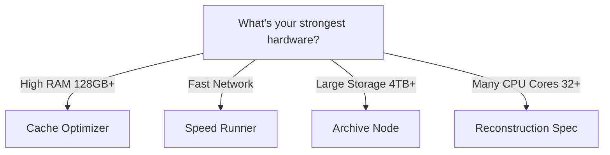

# Node Types

Choosing the right specialization for your hardware.

---

## Overview

| Type | Best Hardware | Reward Bonus |
|------|---------------|--------------|
| **Speed Runner** | High RAM, Low latency | +30% |
| **Cache Optimizer** | Very high RAM | +50% |
| **Archive Node** | Large storage | +20% |
| **Reconstruction Spec** | High CPU | +100% |

---

## Speed Runner

**Best for:** Trading bots, real-time applications

**Requirements:**
- 64GB+ RAM
- NVMe SSD
- Low-latency network

**Configuration:**
```toml
[node]
type = "speed-runner"

[specialization]
target_latency_ms = 1
cache_capacity_gb = 32
```

---

## Cache Optimizer

**Best for:** High-volume applications

**Requirements:**
- 128GB+ RAM
- Fast network

**Configuration:**
```toml
[node]
type = "cache-optimizer"

[specialization]
predictive_caching = true
eviction_policy = "adaptive"
```

---

## Archive Node

**Best for:** Analytics, historical queries

**Requirements:**
- 4TB+ storage
- Compression support

**Configuration:**
```toml
[node]
type = "archive-node"

[specialization]
retention_days = 730
compression_level = 9
```

---

## Reconstruction Specialist

**Best for:** Compressed account recovery

**Requirements:**
- 32+ CPU cores
- 256GB RAM

**Configuration:**
```toml
[node]
type = "reconstruction-spec"

[specialization]
zk_proof_workers = 16
merkle_cache_size_mb = 8192
```

---

## Decision Guide


