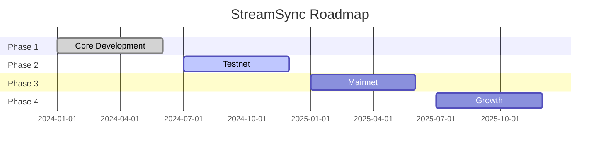

# Roadmap

Development timeline and milestones.

---

## Current Status: Phase 1 Complete

All core systems implemented and tested with 193+ passing tests.

---

## Completed

### Phase 1: Core Development

- [x] **Core Libraries** - networking, sharding, distributed-duckdb
- [x] **$STRM Token Program** - Anchor-based Solana program
- [x] **Payment Gateway** - SOL, STRM, USDC support
- [x] **Settlement Engine** - Batch reward processing
- [x] **Racing Competition** - Parallel query execution
- [x] **Node Specializations** - 4 node types
- [x] **Gossip Protocol** - Push/Pull/Heartbeat
- [x] **Cluster Management** - Rebalancing & health checks

---

## In Progress

### Phase 2: Network Launch

- [ ] **Devnet Deployment** - Deploy token program to Solana devnet
- [ ] **Testnet Launch** - Public testnet with test tokens
- [ ] **Security Audit** - Smart contract and protocol audit
- [ ] **Founding Operators** - Recruit 4-5 initial operators
- [ ] **Documentation** - Complete user and operator guides

---

## Planned

### Phase 3: Mainnet (Q2 2025)

- [ ] **Mainnet Deployment** - Launch on Solana mainnet
- [ ] **Token Launch** - $STRM token generation event
- [ ] **Operator Onboarding** - Open registration
- [ ] **SDK Release** - TypeScript, Rust, Python SDKs

### Phase 4: Growth (Q3-Q4 2025)

- [ ] **Geographic Expansion** - Multi-region coverage
- [ ] **Advanced Features** - Webhooks, streaming
- [ ] **Governance Launch** - DAO voting
- [ ] **Stake Delegation** - Non-operator staking

### Phase 5: Ecosystem (2026+)

- [ ] **Cross-chain Support** - Additional blockchains
- [ ] **Custom Indexers** - User-defined schemas
- [ ] **Enterprise Features** - Dedicated nodes, SLAs
- [ ] **Permissionless Operators** - Automated admission

---

## Milestones

---

## Get Involved

### For Developers

- Contribute on [GitHub](https://github.com/your-org/streamsync)
- Join technical discussions on [Discord](https://discord.gg/streamsync)

### For Operators

- Express interest in becoming a founding operator
- Join the operator waitlist

### For Users

- Try the testnet when available
- Provide feedback on the API
