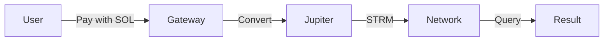

# Pricing

Query pricing tiers and cost structure.

---

## Pricing Tiers

| Tier | Requests/Month | STRM/Request | SOL/Request | Features |
|------|----------------|--------------|-------------|----------|
| **Free** | 1,000 | 0 | 0 | Basic queries |
| **Basic** | 50,000 | 0.001 | 0.00001 | + History, Webhooks |
| **Pro** | 1,000,000 | 0.0008 | 0.000008 | + Analytics, Priority |
| **Enterprise** | Unlimited | 0.0005 | 0.000005 | + SLA, Dedicated support |

---

## Payment Methods

### Accepted Tokens

| Token | Fee Modifier | Best For |
|-------|--------------|----------|
| **STRM** | 1.0x (base) | Lowest cost |
| **SOL** | 1.05x (+5%) | Convenience |
| **USDC** | 1.10x (+10%) | Predictable costs |
| **Other SPL** | 1.15x (+15%) | Custom integrations |

### Payment Flow



---

## Cost Multipliers

### Query Complexity

| Query Type | Multiplier | Example |
|------------|------------|---------|
| `get_transaction` | 1.0x | Single tx lookup |
| `get_account` | 1.2x | Account data |
| `get_token_accounts` | 1.5x | Token holdings |
| `search_transactions` | 2.0x | Transaction search |
| `get_program_accounts` | 3.0x | All program accounts |
| `complex_analytics` | 5.0x | Aggregations |

### Data Size

| Response Size | Multiplier |
|---------------|------------|
| < 1 KB | 1.0x |
| 1-10 KB | 1.2x |
| 10-100 KB | 1.5x |
| > 100 KB | 2.0x |

### Performance Guarantee

| SLA Target | Multiplier |
|------------|------------|
| Best effort | 1.0x |
| < 50ms | 1.2x |
| < 10ms | 1.5x |
| < 5ms | 2.0x |
| < 1ms | 3.0x |

---

## Cost Calculator

### Example 1: Basic Query

```
Query: get_account
Payment: STRM
Tier: Pro
Size: 2 KB
SLA: Best effort

Base cost:     0.0008 STRM
Complexity:    × 1.2
Size:          × 1.0
SLA:           × 1.0
Payment:       × 1.0
─────────────────────
Total:         0.00096 STRM
```

### Example 2: Premium Query

```
Query: search_transactions
Payment: SOL
Tier: Basic
Size: 50 KB
SLA: < 10ms

Base cost:     0.001 STRM
Complexity:    × 2.0
Size:          × 1.5
SLA:           × 1.5
Payment:       × 1.05
─────────────────────
Total:         0.004725 STRM (~0.0000473 SOL)
```

---

## Free Tier

### Included

- 1,000 requests/month
- Basic query types only
- Best-effort latency
- Community support

### Limitations

- No performance guarantees
- Rate limited (10 req/sec)
- No webhooks
- No analytics

### Upgrade Path

```bash
# Check current usage
streamsync account usage

# Upgrade to Pro
streamsync account upgrade pro
```

---

## Enterprise Pricing

### Custom Pricing Available

| Feature | Enterprise |
|---------|------------|
| Volume discounts | Up to 50% off |
| Dedicated nodes | Available |
| Custom SLAs | 99.99% uptime |
| Priority support | 24/7 |
| Custom integrations | Included |

### Contact Sales

```bash
streamsync enterprise contact \
  --email sales@yourcompany.com \
  --volume 100000000  # 100M queries/month
```

---

## Billing

### Prepaid Credits

```bash
# Add credits
streamsync credits add 1000 --pay-with sol

# Check balance
streamsync credits balance

# Set up auto-reload
streamsync credits auto-reload \
  --threshold 100 \
  --amount 500 \
  --pay-with sol
```

### Usage Tracking

```bash
# View current month usage
streamsync usage current

# View usage history
streamsync usage history --months 6

# Export for accounting
streamsync usage export --format csv
```

---

## SLA Guarantees

### Performance SLA

| Target | Refund if Missed |
|--------|------------------|
| < 50ms | 100% of query cost |
| < 10ms | 100% of query cost |
| < 5ms | 100% of query cost |
| < 1ms | 100% of query cost |

### Availability SLA (Enterprise)

| Uptime | Credit |
|--------|--------|
| 99.9% - 99.99% | 10% of monthly |
| 99.0% - 99.9% | 25% of monthly |
| < 99.0% | 50% of monthly |

---

## Cost Optimization

### Tips

1. **Use STRM** - Save 5-15% vs other tokens
2. **Batch queries** - Combine related lookups
3. **Cache results** - Don't repeat queries
4. **Right-size SLA** - Don't pay for latency you don't need
5. **Choose right tier** - Higher tiers have lower per-query cost

### Volume Discounts

| Monthly Volume | Discount |
|----------------|----------|
| 1M - 10M | 5% |
| 10M - 100M | 15% |
| 100M - 1B | 25% |
| > 1B | Custom |

---

## FAQ

??? question "What happens if I exceed my tier limit?"
    Queries continue at the next tier's rate, or upgrade automatically.

??? question "Are refunds available?"
    Yes, for SLA violations. Automatic. No action needed.

??? question "Can I pay in fiat?"
    Enterprise tier offers fiat invoicing options.

??? question "What's the minimum purchase?"
    No minimum. Pay per query.
