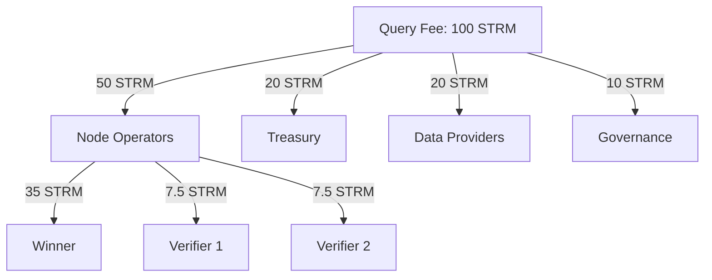

# Rewards

How node operators earn rewards on the StreamSync network.

---

## Reward Sources

### 1. Query Racing (Primary)

Earn by winning query races:

| Role | Share | Description |
|------|-------|-------------|
| **Winner** | 70% | First correct response |
| **Verifier 1** | 15% | Confirms correctness |
| **Verifier 2** | 15% | Confirms correctness |

### 2. Specialization Bonuses

Additional rewards for specialized capabilities:

| Specialization | Bonus |
|----------------|-------|
| Speed Runner | +30% |
| Cache Optimizer | +50% |
| Archive Node | +20% |
| Reconstruction Spec | +100% |

### 3. Performance Bonuses

Extra rewards for exceptional performance:

| Achievement | Bonus |
|-------------|-------|
| Sub-1ms response | +50% |
| Sub-5ms response | +20% |
| Perfect accuracy | +10% |

---

## Reward Calculation

### Example Query

```
Query Payment: 100 STRM
Node Type: Speed Runner (+30%)
Response Time: 3ms (+20% bonus)
```

**Winner Calculation:**
```
Base: 100 × 50% (node share) × 70% (winner) = 35 STRM
Specialization: 35 × 1.30 = 45.5 STRM
Performance: 45.5 × 1.20 = 54.6 STRM

Winner receives: 54.6 STRM
```

**Verifier Calculation:**
```
Each verifier: 100 × 50% × 15% = 7.5 STRM
```

---

## Revenue Distribution



---

## Claiming Rewards

### Batch Settlement

Rewards are batched every 5 minutes for gas efficiency:

```mermaid
timeline
    title Reward Settlement
    12:00 : Queries 1-100 executed
    12:05 : Batch 1 settled on-chain
    12:05 : Queries 101-200 executed
    12:10 : Batch 2 settled on-chain
```

### Claim Rewards

```bash
# View pending rewards
streamsync rewards pending

# Claim all rewards
streamsync rewards claim

# View claim history
streamsync rewards history
```

### Auto-Claim

Set up automatic claiming:

```toml
# In node.toml
[economics]
auto_claim_threshold = 100.0  # Claim when reaching 100 STRM
```

---

## Reward Projections

### Daily Revenue Estimates

Based on network utilization:

| Network Stage | Daily Queries | Node Share | Daily Revenue |
|---------------|---------------|------------|---------------|
| Launch | 100K | 50 STRM | ~$5 |
| Growth | 10M | 4,000 STRM | ~$400 |
| Mature | 1B | 250,000 STRM | ~$25,000 |

*Assumes 10 active nodes, $0.10/STRM*

### Monthly Revenue by Node Type

At network maturity (1B daily queries, 100 nodes):

| Node Type | Queries Won | Monthly Revenue |
|-----------|-------------|-----------------|
| Speed Runner | 300K/day | ~9,000 STRM |
| Cache Optimizer | 250K/day | ~11,250 STRM |
| Archive Node | 50K/day | ~1,800 STRM |
| Reconstruction | 25K/day | ~1,500 STRM |

---

## Maximizing Rewards

### 1. Optimize Performance

```rust
// Faster = more wins
priority_order = [
    "Minimize latency",     // #1 factor for winning
    "Maximize accuracy",    // Required for payment
    "Maintain uptime",      // Stay in selection pool
];
```

### 2. Choose Right Specialization

Match your hardware to specialization:

| Hardware Strength | Best Specialization |
|-------------------|---------------------|
| High RAM (128GB+) | Cache Optimizer |
| Low-latency network | Speed Runner |
| Large storage (4TB+) | Archive Node |
| High CPU (32+ cores) | Reconstruction Spec |

### 3. Increase Stake

Higher stake = higher selection probability:

```bash
# Check current weight
streamsync stake status

# Add stake for higher weight
streamsync stake add 40000  # 10K → 50K = 1.5x weight
```

### 4. Geographic Positioning

Position near major user clusters:

- US East (NYC, Virginia)
- US West (California)
- Europe (Frankfurt, London)
- Asia (Singapore, Tokyo)

---

## Reward Analytics

### Dashboard

View detailed analytics:

```bash
# Today's performance
streamsync analytics today

# Weekly summary
streamsync analytics weekly

# Export data
streamsync analytics export --format csv --days 30
```

### Sample Output

```
Daily Analytics - 2024-01-15
============================
Queries Won:        1,234
Queries Verified:     456
Win Rate:           73.2%
Avg Response Time:  4.2ms

Rewards Earned:
  Racing Wins:      85.50 STRM
  Verification:     12.30 STRM
  Bonuses:          18.20 STRM
  Total:           116.00 STRM

Performance Rank: #12 of 87 nodes
```

---

## Tax Considerations

!!! warning "Not Financial Advice"
    Consult a tax professional in your jurisdiction.

### Record Keeping

Export rewards for tax purposes:

```bash
# Export all rewards for tax year
streamsync rewards export \
  --start 2024-01-01 \
  --end 2024-12-31 \
  --format csv \
  --output rewards-2024.csv
```

### Typical Tax Events

| Event | Taxable? |
|-------|----------|
| Receiving STRM rewards | Usually yes (income) |
| Selling STRM | Usually yes (capital gains) |
| Staking STRM | Usually no |
| Getting slashed | Possibly deductible |

---

## FAQ

??? question "When are rewards claimable?"
    Rewards are settled every 5 minutes. Claimable immediately after settlement.

??? question "Is there a minimum claim amount?"
    No minimum, but gas costs ~0.00001 SOL per claim. Batching recommended.

??? question "Do rewards compound automatically?"
    No. Claim and re-stake manually, or set auto-claim threshold.

??? question "What if I miss a race?"
    No reward for that query, but no penalty. Focus on winning next one.
