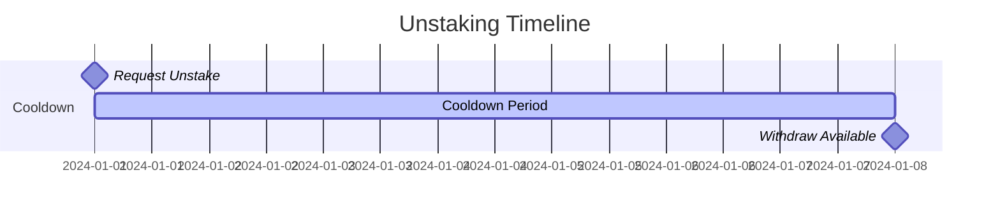
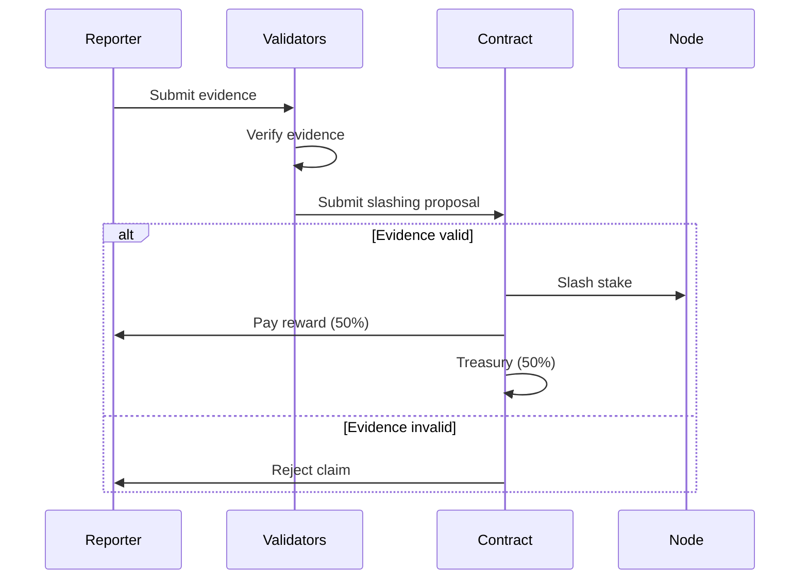

# Staking

How to stake STRM tokens to become a node operator.

---

## Overview

Staking STRM is required to operate a node on the StreamSync network. Stakes serve as:

- **Collateral** against misbehavior
- **Economic commitment** to the network
- **Selection weight** for query routing

---

## Staking Requirements

| Parameter | Value |
|-----------|-------|
| **Minimum Stake** | 10,000 STRM |
| **Unstaking Cooldown** | 7 days |
| **Maximum Slashing** | 10% per incident |

---

## How to Stake

### Using CLI

```bash
# Check your wallet balance
streamsync wallet balance

# Stake 10,000 STRM
streamsync stake 10000

# Stake to a specific node
streamsync stake 10000 --node-pubkey <NODE_PUBKEY>

# Check staking status
streamsync stake status
```

### Using Anchor/Solana

```typescript
import { Program, AnchorProvider } from "@coral-xyz/anchor";
import { StrmToken } from "./idl/strm_token";

const program = new Program<StrmToken>(IDL, programId, provider);

// Stake tokens
await program.methods
  .stake(new BN(10000 * 1e9)) // 10,000 STRM with 9 decimals
  .accounts({
    owner: wallet.publicKey,
    stakeAccount: stakeAccountPda,
    tokenAccount: userTokenAccount,
    stakeVault: stakeVaultPda,
    tokenProgram: TOKEN_PROGRAM_ID,
  })
  .rpc();
```

---

## Staking Benefits

### Selection Weight

Higher stakes increase probability of being selected for queries:

| Stake Amount | Selection Weight | Queries/Day (est.) |
|--------------|------------------|-------------------|
| 10,000 STRM | 1.0x | 1,000 |
| 50,000 STRM | 1.5x | 1,500 |
| 100,000 STRM | 2.0x | 2,000 |
| 500,000 STRM | 3.0x | 3,000 |
| 1,000,000 STRM | 4.0x | 4,000 |

### Reward Multiplier

```rust
fn calculate_stake_multiplier(stake: u64) -> f64 {
    match stake {
        s if s >= 1_000_000 => 1.5,
        s if s >= 500_000 => 1.3,
        s if s >= 100_000 => 1.2,
        s if s >= 50_000 => 1.1,
        _ => 1.0,
    }
}
```

---

## Adding Stake

Increase your stake at any time:

```bash
# Add 5,000 more STRM
streamsync stake add 5000

# Check new total
streamsync stake status
```

---

## Unstaking

### Start Unstaking

```bash
# Begin unstaking 5,000 STRM
streamsync unstake 5000

# Check cooldown status
streamsync stake status
```

### Cooldown Period



During cooldown:

- Tokens remain staked
- Node continues operating
- Rewards continue accruing
- No additional unstaking allowed

### Complete Withdrawal

After 7 days:

```bash
# Withdraw unstaked tokens
streamsync withdraw

# Tokens returned to wallet
streamsync wallet balance
```

---

## Slashing

Stakes can be slashed for misbehavior:

### Slashing Conditions

| Violation | Penalty | Evidence Required |
|-----------|---------|-------------------|
| Wrong query result | 2% | Conflicting proof |
| Extended downtime | 0.5% | Missed heartbeats |
| Consensus violation | 5% | Protocol logs |
| Malicious behavior | 10% | Multiple validators |

### Slashing Process



### Slashing Protection

Minimize slashing risk:

1. **Maintain uptime** - Use redundant infrastructure
2. **Monitor performance** - Set up alerts
3. **Stay updated** - Run latest software version
4. **Test updates** - Use devnet before mainnet

---

## Stake Management

### View Staking Status

```bash
$ streamsync stake status

Stake Account: StakeXXXXXXXXXXXXXXXXXXXXXXXXXXXXXXXXXX
Owner: WalletYYYYYYYYYYYYYYYYYYYYYYYYYYYYYYYYYYYY

Staked Amount:     50,000.00 STRM
Pending Unstake:        0.00 STRM
Pending Rewards:      125.50 STRM
Total Earned:       2,450.00 STRM

Selection Weight: 1.5x
Reward Multiplier: 1.1x

Status: Active
Uptime: 99.8%
```

### Claim Rewards

```bash
# Claim all pending rewards
streamsync rewards claim

# Check reward history
streamsync rewards history --days 30
```

---

## Best Practices

### For New Operators

1. Start with minimum stake (10,000 STRM)
2. Prove performance over 1-2 weeks
3. Gradually increase stake
4. Reinvest rewards

### For Established Operators

1. Maintain 50,000+ STRM for 1.5x weight
2. Monitor competitors' stakes
3. Consider multi-node setups
4. Keep reserve for unexpected slashing

### Stake Optimization

```
Optimal stake = (Expected daily queries × Avg reward) / Target ROI

Example:
- Target: 20% annual ROI
- Expected: 2,000 queries/day @ 0.001 STRM each
- Daily revenue: 2 STRM
- Annual revenue: 730 STRM
- Optimal stake: 730 / 0.20 = 3,650 STRM

→ Minimum stake (10,000) provides ~7.3% ROI in this example
```

---

## FAQ

??? question "Can I stake to multiple nodes?"
    Yes, but each node requires its own stake account with minimum 10,000 STRM.

??? question "What if my node goes offline during unstaking?"
    Cooldown continues. Rewards stop. No additional slashing for planned downtime.

??? question "Can I cancel unstaking?"
    Yes, run `streamsync stake cancel-unstake` during the cooldown period.

??? question "Are rewards auto-compounded?"
    No, rewards must be claimed and re-staked manually. Auto-compound coming in Phase 2.
