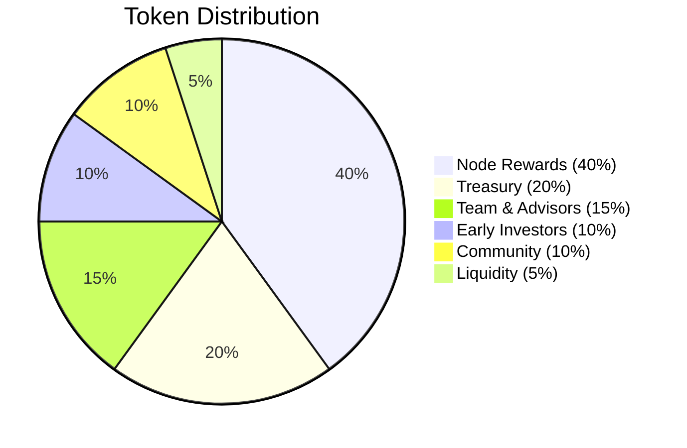
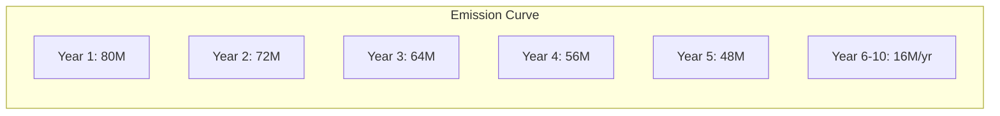
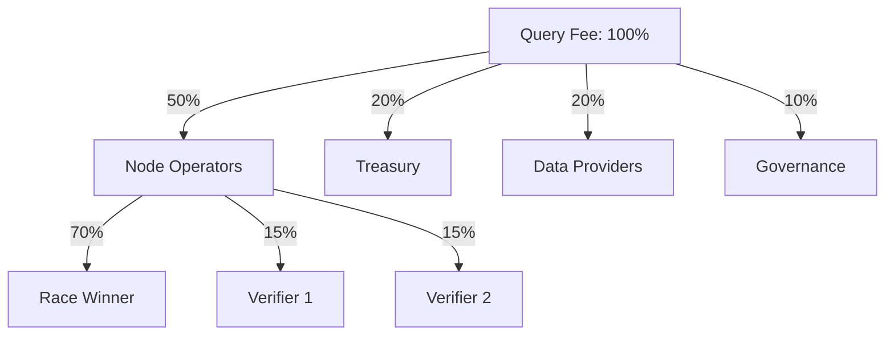

# $STRM Token

The native utility token of the StreamSync network.

---

## Token Overview

| Property | Value |
|----------|-------|
| **Symbol** | STRM |
| **Blockchain** | Solana |
| **Token Standard** | SPL Token |
| **Decimals** | 9 |
| **Total Supply** | 1,000,000,000 STRM |

---

## Token Utility

### 1. Query Payments

Users pay for queries with STRM (or SOL/USDC with auto-conversion):

```rust
// Query with STRM
streamsync query account <PUBKEY> --pay-with strm

// Query with SOL (auto-converts)
streamsync query account <PUBKEY> --pay-with sol
```

### 2. Node Staking

Operators stake STRM to run nodes:

| Requirement | Amount |
|-------------|--------|
| Minimum stake | 10,000 STRM |
| Recommended stake | 50,000+ STRM |
| Maximum benefit | 1,000,000 STRM |

### 3. Governance

Token holders vote on protocol parameters:

- Reward percentages
- Staking requirements
- Slashing conditions
- Protocol upgrades

### 4. Fee Discounts

STRM payments receive lower fees than SOL/USDC:

| Payment Method | Fee Discount |
|----------------|--------------|
| STRM | 0% (base rate) |
| SOL | +5% |
| USDC | +10% |

---

## Token Distribution



### Allocation Details

| Allocation | Amount | Vesting |
|------------|--------|---------|
| **Node Operator Rewards** | 400M STRM | Emitted over 10 years |
| **Protocol Treasury** | 200M STRM | DAO controlled |
| **Team & Advisors** | 150M STRM | 4-year vesting, 1-year cliff |
| **Early Investors** | 100M STRM | 2-year vesting, 6-month cliff |
| **Community & Ecosystem** | 100M STRM | Grants, bounties, partnerships |
| **Liquidity** | 50M STRM | DEX liquidity provision |

---

## Emission Schedule

Node operator rewards are emitted over 10 years with decreasing rate:

| Year | Annual Emission | Cumulative |
|------|-----------------|------------|
| 1 | 80M STRM | 80M |
| 2 | 72M STRM | 152M |
| 3 | 64M STRM | 216M |
| 4 | 56M STRM | 272M |
| 5 | 48M STRM | 320M |
| 6-10 | 16M/year | 400M |



---

## Revenue Flow

All query fees are distributed:



### Distribution Breakdown

| Recipient | Share | Purpose |
|-----------|-------|---------|
| **Node Operators** | 50% | Reward query service |
| **Protocol Treasury** | 20% | Development, audits, operations |
| **Data Providers** | 20% | Solana RPC providers |
| **Governance** | 10% | STRM staker rewards |

---

## Smart Contract

### Program Address

```
STRMxxxxxxxxxxxxxxxxxxxxxxxxxxxxxxxxxxx (Mainnet)
STRMTestxxxxxxxxxxxxxxxxxxxxxxxxxxxxxxxxx (Devnet)
```

### Key Accounts

```rust
// Global configuration (PDA)
ProgramConfig {
    admin: Pubkey,
    oracle_authority: Pubkey,
    min_stake: u64,           // 10,000 STRM
    cooldown_seconds: i64,    // 604,800 (7 days)
    winner_bps: u16,          // 7000 (70%)
    verifier_bps: u16,        // 1500 (15%)
    protocol_fee_bps: u16,    // 2000 (20%)
}

// Per-node stake account (PDA)
NodeStake {
    owner: Pubkey,
    staked_amount: u64,
    pending_rewards: u64,
    total_earned: u64,
    specialization: NodeSpecialization,
}
```

### Instructions

| Instruction | Description |
|-------------|-------------|
| `stake` | Stake STRM to become node operator |
| `add_stake` | Increase existing stake |
| `begin_unstake` | Start 7-day unstaking cooldown |
| `withdraw` | Complete unstake after cooldown |
| `claim_rewards` | Claim pending rewards |
| `record_reward` | Record query reward (oracle only) |
| `process_batch` | Settle pending rewards batch |
| `slash` | Penalize misbehaving node |

---

## Token Mechanics

### Staking Benefits

Higher stakes provide:

| Stake Amount | Selection Weight | Reward Multiplier |
|--------------|------------------|-------------------|
| 10,000 STRM | 1.0x | 1.0x |
| 50,000 STRM | 1.5x | 1.1x |
| 100,000 STRM | 2.0x | 1.2x |
| 500,000 STRM | 3.0x | 1.3x |
| 1,000,000 STRM | 4.0x | 1.5x |

### Slashing Conditions

| Violation | Penalty |
|-----------|---------|
| Incorrect query result | 2% of stake |
| Downtime > 1 hour | 0.5% of stake |
| Consensus violation | 5% of stake |
| Malicious behavior | 10% of stake |

---

## Where to Get STRM

### Decentralized Exchanges

- **Jupiter** - Primary liquidity
- **Raydium** - AMM pools
- **Orca** - Concentrated liquidity

### Centralized Exchanges

Coming soon

### Faucet (Devnet)

```bash
# Get devnet STRM for testing
streamsync faucet --amount 10000
```

---

## Token Security

### Audits

- [ ] Smart contract audit (pending)
- [ ] Economic model review (pending)

### Multi-sig

Treasury and admin functions controlled by multi-sig:

- 3/5 signatures required
- 24-hour timelock on major changes

---

## FAQ

??? question "Is STRM required to use the network?"
    No. You can pay with SOL or USDC, which are auto-converted. STRM just offers the lowest fees.

??? question "What happens to slashed tokens?"
    50% goes to the reporter, 50% to treasury.

??? question "Can I delegate my stake?"
    Delegation is planned for Phase 2.

??? question "What's the inflation rate?"
    Year 1: 8%, decreasing to 1.6% by year 6+
